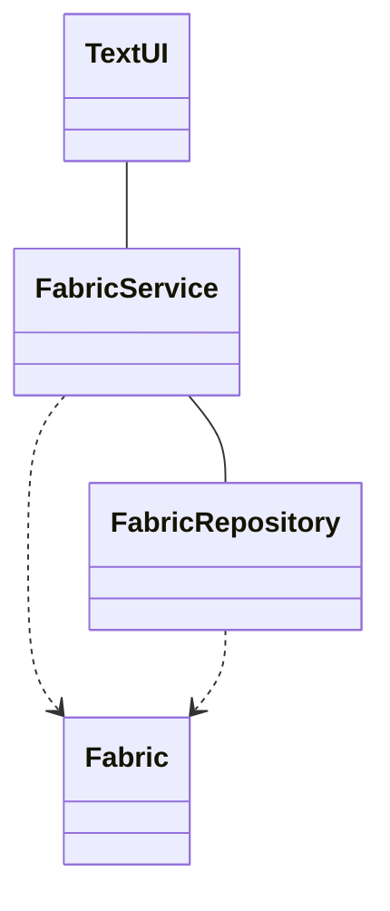

Ohjelman luokkakaavion tämänhetkinen rakenne

```mermaid
 classDiagram
      TextUI -- FabricService
      FabricService -- FabricRepository
      FabricService ..> Fabric
      FabricRepository ..> Fabric
      
      class TextUI{
      }
      class FabricService{
      }
      class FabricRepository{
      }
      class Fabric{
      }
```
