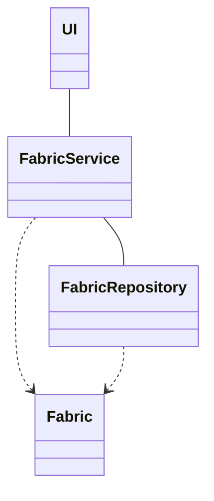

Ohjelman luokien tämänhetkinen rakenne

```mermaid
 classDiagram
      UI -- FabricService
      FabricService -- FabricRepository
      FabricService ..> Fabric
      FabricRepository ..> Fabric
      
      class UI{
      }
      class FabricService{
      }
      class FabricRepository{
      }
      class Fabric{
      }
```
Create new fabric

```mermaid
 sequenceDiagram
      actor User
      participant GUI
      participant S as FabricService
      participant R as FabricRepository
      participant F as Fabric
      
      User ->> GUI: press "add fabric" button
      GUI ->> S: add_fabric("",0,0,0)
      S ->> F: Fabric("",0,0,0)
      F -->> S: fabric
      S ->> R: add_fabric(fabric)
      GUI ->> S: get_all_ids()
      S -->> GUI: all_ids
      GUI ->> GUI: show_fabric_edit_view(all_ids[-1])
      
      
```

