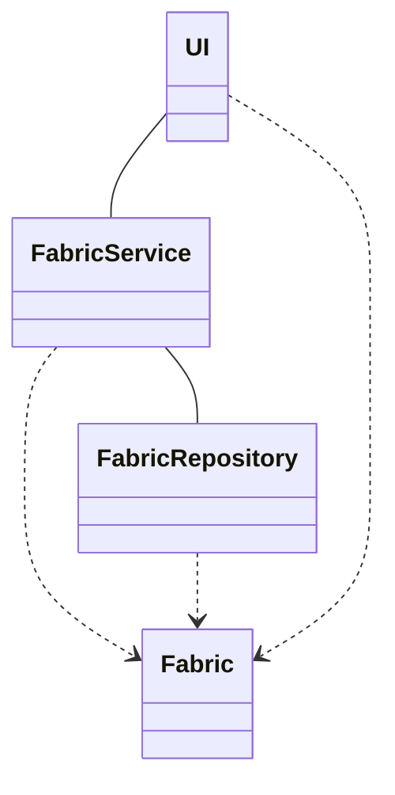
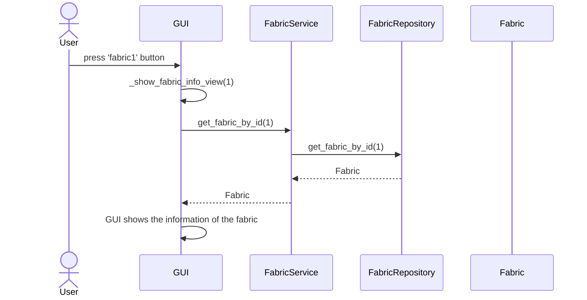
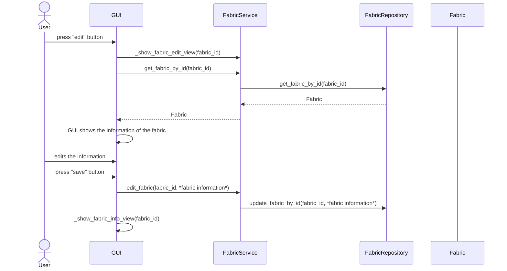
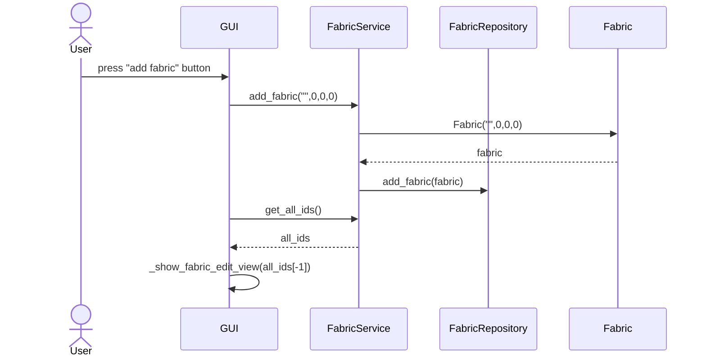

# Architecture

## Structure

The application is structured with a three tier architecture, with separate layers for the UI, services and data access. The source code is structured in the following pacages:
 - ui
 - services
 - repositories
 - entities

The UI pacage consists of the classes for presenting the Graphic User Interface and handling the user commands. The services package contains a class for handling the application logic, while the repositories pacage contains a class for managing saving and retrieving the data in the database. Entities contains a Fabric class for encapsulaiton and representation of fabric information.

In addition there are directories for unit test code and the database files.

## User interface

The user interface contains the following views as their own classes:
 - List view: list of all the saved fabrics
 - Info view: list of the information of one fabric
 - Edit view: view for editing the information of new or saved fabric
 - Search view: view for searching for fabrics based on different properties

In addition there is a general GUI class for the event handlers and handling transitions between the different views.

## Data storage

The fabric data is persistently stored in an SQLite database. The database and connection are initialized on startup of the application.

## Logic

The FabricServices class provides the functionality between the UI and the FabricRepository. The UI utilizes the methods provided by the FabricServices, which in turn uses the FabricRepository class to access and store information in the SQLite database.
The Fabric class is used throughout the application to encapsulate fabric information and to easier pass it between the different classes.

Further bellow are demonstrated the command sequences of a few of the application's main functionalities.

## Main functionality

### Viewing fabric information

When a user presses the button of a fabric in the list view, the application shows that fabric's information in the info view. 

The GUI handles showing the correct fabric's information by passing the fabric's id between it's different views, in this case from the list view to the info view. This is done by the event handler methods of the GUI class. When the user presses a button assosiated with the fabric with id 1, the GUI changes into the info view and passes the id to it. While in the info view, the information of the fabric assosiated with the id 1 is fetched from the database via the service layer, and then correctly presented in the GUI.

### Editing information of a saved fabric

While in the info view, a user can edit the information of the currently viewed fabric.

When the user presses the edit button, the GUI again changes view and passes on the fabric id. Similarly to the info view, the GUI fetches the information of the fabric via the service layer to show the current information to the user. The user can then edit the information they want to. After pressing the save button, the GUI passes the id and information to the services which again passing the information from to the repository to be saved. If the user were to press the cancel button instead, the GUI would simply not call the services and the information would not be saved to the database. Afterwards, the GUI returns to the info view.

### Saving a new fabric

When a user clicks on a button to add a new fabric, the following commands are executed:

When the user presses the add fabric button, a new 'dummy fabric' is created to the database. The GUI then shows this fabrics information in the edit view. After this, the program proceeds similarly as depicted in the sequence diagram for editing information of a saved fabric.

Other functionality in the program follows similar patterns: the user clicks a button, UI handlers call the associated service methods which handles fetching or saving data in the database via the repository class. The data or changes to the data are then presented to the user via the UI.

### Possible structural improvements
The code for the graphic user interface could be refactored to reduce repeated code accross the different views. 
The service and repository classes also contain some redundancy in the methods for fetching data from the database, which could become especially problematic were the amount of fabric properties increased.

